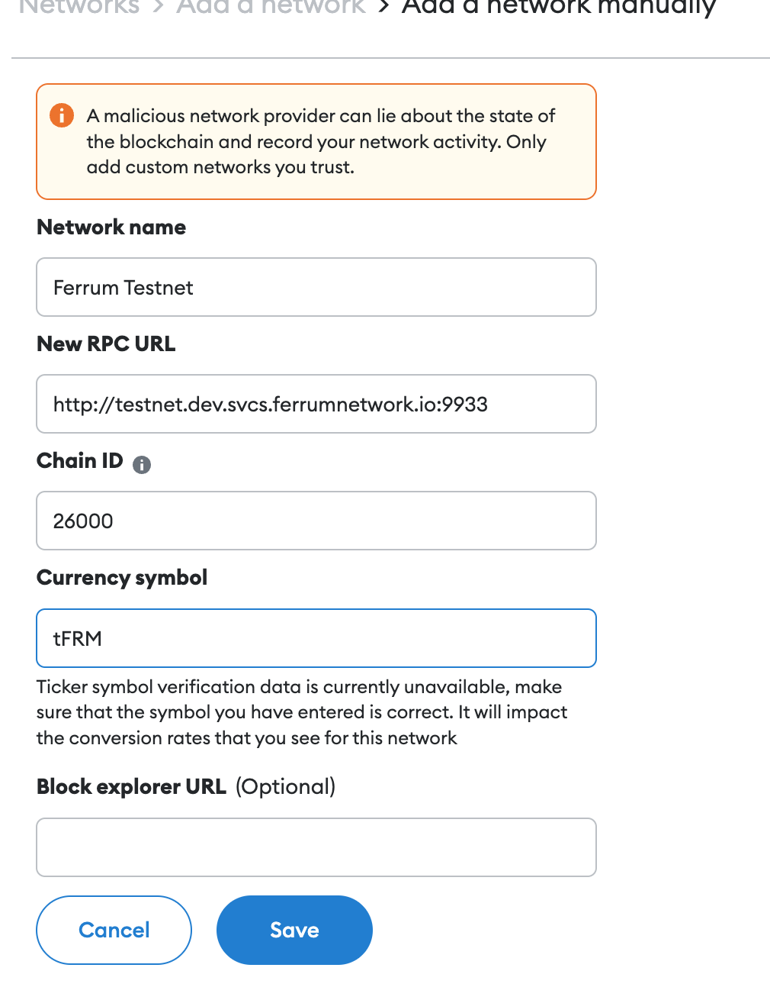

# How to connect metamask to Ferrum Testnet

## Where to view transactions

Substrate Explorer : https://polkadot.js.org/apps/?rpc=wss%3A%2F%2Ftestnet.dev.svcs.ferrumnetwork.io#/explorer

### Faucet 

https://testnet.dev.svcs.ferrumnetwork.io/faucet/

## Config

Network Name : Ferrum Testnet

RPC URL : http://testnet.dev.svcs.ferrumnetwork.io:9933

ChainId : 26000

Currency : tFRM

## Example 

