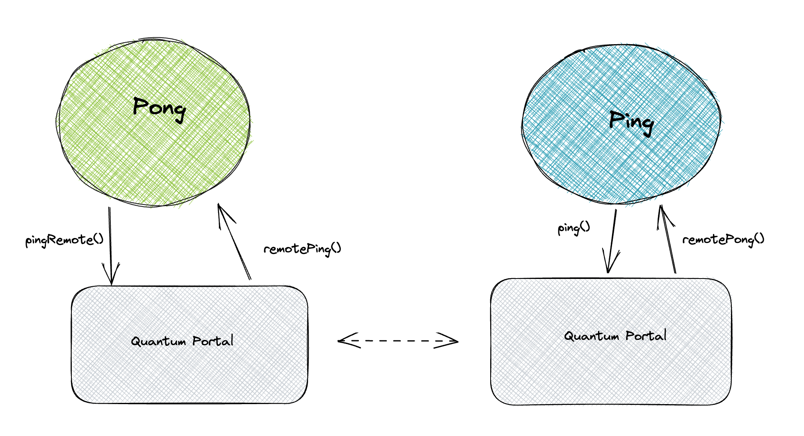

# Develop using Quantum Portal

This section covers how to write a solidity smart contract to take advantage of cross chain communication offered by Quantum portal.

### Your First Contract

For the fist example lets build a simple ping-pong contract, the contract will send a ping message to a remote contract deployed on another network and the pong contract will receive the ping message and send a pong message back to the caller.



## Pong Contract

```solidity
pragma solidity ^0.8.0;
pragma solidity ^0.8.0;
import "quantum-portal-smart-contracts/contracts/quantumPortal/poc/IQuantumPortalPoc.sol";
import "quantum-portal-smart-contracts/contracts/quantumPortal/poc/IQuantumPortalFeeManager.sol";

contract Pong  {
    uint256 public CHAIN_ID;
    IQuantumPortalPoc public portal;
    mapping (address => uint) public pings;
    address public pingContract;
    uint256 fee;

    constructor() {
        initialize();
    }

    function initialize() internal virtual {
        uint256 overrideChainID; // for test only. provide 0 outside a test
        address portal_address;
        uint256 constantFee;
        fee = constantFee;
        portal = IQuantumPortalPoc(portal_address);
        CHAIN_ID = overrideChainID == 0 ? block.chainid : overrideChainID;
    }

    /**
     @notice This function should be called by the QuantumPortal
     */
    function pingRemote() external {
        // caller is QP
        (uint netId, address sourceMsgSender, address beneficiary) = portal.msgSender();
        // ensure the caller is the ping contract
        require(sourceMsgSender == pingContract, "Caller not expected!");
        pings[sourceMsgSender] += 1;
    }

    function pong(address recipient, uint256 chainId) external {
        pings[recipient] -= 1;
        bytes memory method = abi.encodeWithSelector(Ping.remotePong.selector);
        portal.run(
            fee, uint64(chainId), pingContract, msg.sender, method);
    }

    function setPingContractAddress(address contractAddress) external {
        pingContract = contractAddress;
    }
}
```


## Ping Contract

```solidity
contract Ping {
    IQuantumPortalPoc public portal;
    uint256 public MASTER_CHAIN_ID = 26000; // The FRM chain ID
    address public PongContract;
    mapping (address => uint) public pongs;
    uint256 fee;

    constructor() {
        initialize();
    }

    function initialize() internal virtual {
        uint256 overrideChainID; // for test only. provide 0 outside a test
        uint256 constantFee;
        fee = constantFee;
        address portal_address;
        portal = IQuantumPortalPoc(portal_address);
    }

    function ping() external {
        bytes memory method = abi.encodeWithSelector(Pong.pingRemote.selector);
        portal.run(
            fee, uint64(MASTER_CHAIN_ID), PongContract, msg.sender, method);
    }

    function remotePong (address recipient) external {
        pongs[recipient] += 1;
    }
}
```