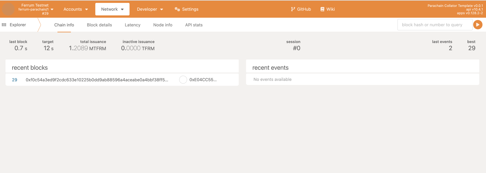
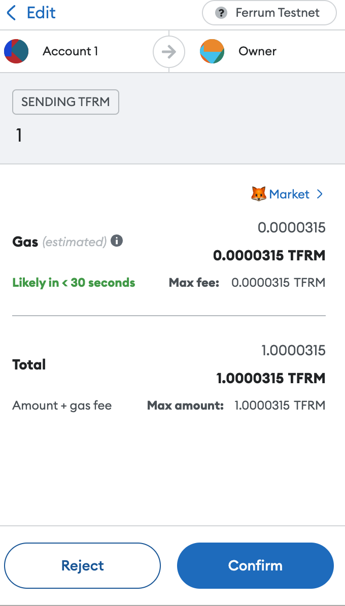
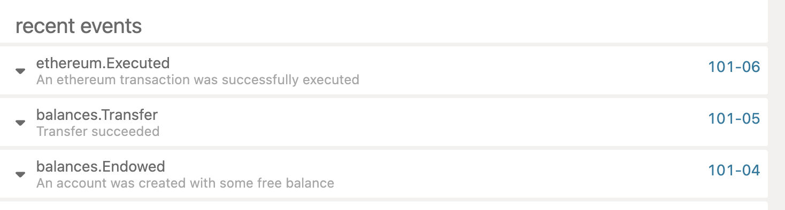

# Getting Started

## Table of Contents:

* [Connecting to Ferrum Network](#connecting-to-ferrum-network)
* [Requesting Testnet tokens](#requesting-testnet-tokens)
* [Transferring tokens](#transferring-tokens)
* [Verifying Transactions](#verifying-transactions)

## Connecting to ferrum network

### 1. Using PolkadotJS

Ferrum network is available at [testnet.dev.svcs.ferrumnetwork.io](https://polkadot.js.org/apps/?rpc=wss%3A%2F%2Ftestnet.dev.svcs.ferrumnetwork.io#/explorer)

You should be able to view the network like below : 



### 2. Using Metamask

To connect your metamask to Ferrum network, use the below configuration

```
Network Name : Ferrum Testnet

RPC URL : https://testnet.dev.svcs.ferrumnetwork.io/rpc/

ChainId : 26100

Currency : tFRM
```

The config should look like this :


## Requesting Testnet tokens

You can use the below faucet to request testnet tokens : 

https://testnet.faucet.ferrumnetwork.io/

## Transferring tokens

Ferrum network parachain supports all evm transactions, so transferring tFRM tokens should be like transferring any other erc20 token :

To transfer tFRM token on the Ferrum network, switch your metamask to `Ferrum Testnet`


Enter the destination address and amount and confirm the transfer




## Verifying transactions

All transactions (both substrate and evm transactions) can be seen on the ferrum explorer at [testnet.dev.svcs.ferrumnetwork.io](https://polkadot.js.org/apps/?rpc=wss%3A%2F%2Ftestnet.dev.svcs.ferrumnetwork.io#/explorer)

In the above case, if you navigate to the explorer, you should see the transfer events on the network tab like below :



If you click on any event, you should see the details of that event :

